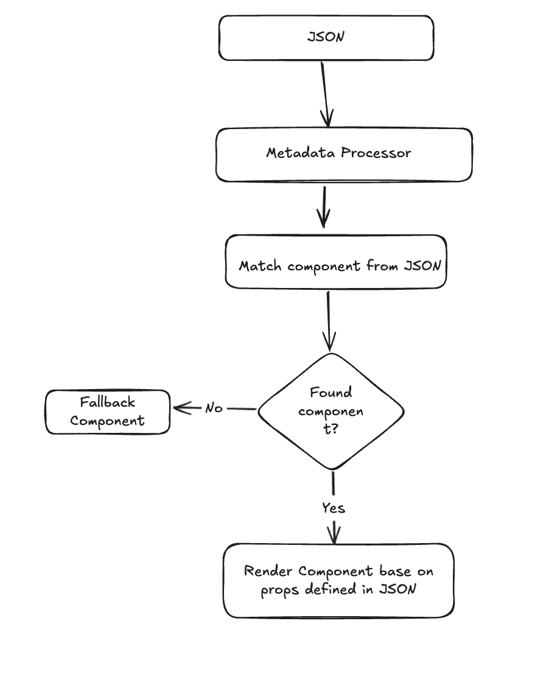

# metadata-ui



# Metadata-Driven UI in Vue 3

## Overview

This project implements a **Metadata-Driven UI** using **Vue 3** with the **Composition API**. The goal is to dynamically render components based on JSON metadata provided from an external source. This solution is flexible, scalable, and extensible, allowing for easy updates to the UI without modifying the underlying codebase.

## Folder Structure

```
src/
    assets/
        baseVariants.js # Tailwind classes for defined components
    components/
        MetadataProcessor.vue # Renders UI based on metadata
            core/
                Heading.vue        # Heading component
                ImageComponent.vue # Image component
                Button.vue         # Button component
                FormComponent.vue  # Form Component

    view/
        Home.vue  # Imports MetadataProcessor
        About.vue # Showcases requirement - Support data flow 
    App.vue              # Root component
    main.js              # Entry point
```

## 1. Input Structure (JSON Format)

The external metadata is passed as JSON, defining which components to render and what data to pass.

```json
    [
        {
            "type": "Heading",
            "props": {
                "text": "Welcome to the Metadata-Driven UI",
                "variant": "headingPrimary"
            }
        },
        {
            "type": "ImageComponent",
            "props": {
                "src": "https://test-img.com",
                "alt": "Placeholder image",
                "variant": "imageRounded"
            }
        },
        {
            "type": "ButtonComponent",
            "props": {
                "label": "Click Me",
                "onClick": "test-api.com",
                "variant": "buttonPrimary"
            }
        }
    
    ]
```

## 2. Dummy Components

### **Heading.vue**
Displays text passed via the `text`, `className`, etc prop.

```vue
<template>
  <h1>{{ text }}</h1>
</template>
<script>
export default {
  props: {
    text: String
  }
}
</script>
```

### **Image.vue**
Displays an image with `src`, `alt`, etc props.

### **Button.vue**
Displays a button, triggers an event when clicked.

## 3. Metadata Processor

The `MetadataProcessor.vue` processes the metadata and renders the components dynamically.
This also supports passing variants as Tailwind CSS classes in the metadata, which are applied to components for dynamic styling.

## 4. Data Flow

Data is passed as props from `MetadataProcessor` to child components. Events like button clicks are captured using custom events.

## 5. Risks and Mitigation

### **1. Invalid Metadata**
**Risk**: Malformed metadata can prevent rendering.  
**Mitigation**: Validate metadata before rendering, display error messages for invalid data.

### **2. Unsupported Component Type**
**Risk**: Unmapped component types may fail to render.  
**Mitigation**: Use a fallback component to display an error.

### **3. Prop Mismatch**
**Risk**: Incorrect props may cause rendering issues.  
**Mitigation**: Use prop validation to handle mismatched data.

### **4. Performance Issues**
**Risk**: Large metadata may impact performance.  
**Mitigation**: Implement lazy loading for large datasets.


## Conclusion

This Vue 3-based solution demonstrates how to build a **Metadata-Driven UI**. It is flexible, scalable, and easily extensible, providing a foundation for future updates and component additions.
